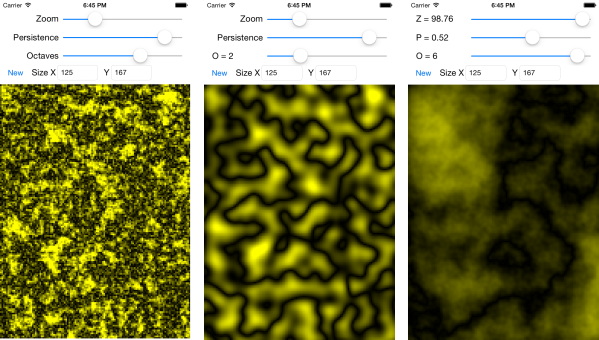

# perlin-swift
Perlin noise generator implemented in Swift

This project is a based on a port of the CZGPerlinGenerator class as implemented in the [perlin-iOS](https://github.com/czgarrett/perlin-ios) project.

It contains a demo app for experimenting with the PerlinGenerator parameters.

# Performance notes
As of XCode 6.4 and an aging iPhone 4s, there is a noticable difference in performance between release and debug builds. A release build runs approximately 4 times quicker.

The implementation of the PerlinGenerator in the `master` branch of this repository supports 4 dimensions, although only two are visualised in the demo app. I've implemented a 2D version of the noise generator in the `feature-2d-only` branch, it is much quicker and allows the demo app to update in real-time.

# License
MIT

